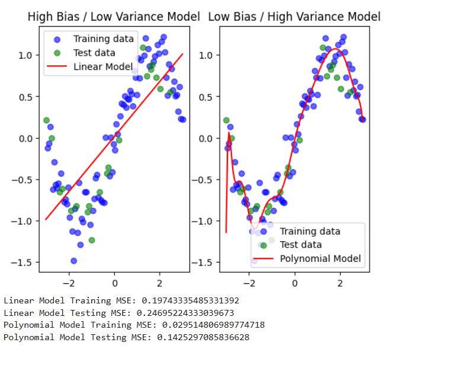

# Bias-Variance Tradeoff in Machine Learning

The **Bias-Variance Tradeoff** is a fundamental concept in machine learning that describes the balance between two sources of error that affect model performance:

- **Bias**: Error due to overly simplistic assumptions in the learning algorithm.
- **Variance**: Error due to excessive complexity in the model, leading to sensitivity to noise.

---

##  Understanding Bias and Variance
### **1️⃣ High Bias / Low Variance (Underfitting)**
- **Model Type**: Linear Model (Simple Model)
- **Characteristics**:
  ✅ Makes strong assumptions  
  ✅ Oversimplifies the data  
  ❌ Poor training & testing accuracy  

### **2️⃣ Low Bias / High Variance (Overfitting)**
- **Model Type**: Polynomial Model (Complex Model)
- **Characteristics**:
  ✅ Captures data patterns well  
  ❌ Too sensitive to noise  
  ❌ Poor generalization to unseen data  

---

## 📊 Visual Representation

The image below illustrates **Bias-Variance Tradeoff** using a **Linear Model** and a **Polynomial Model**.

- **Left Plot (Linear Model - High Bias, Low Variance)**:
  - The model is too simple, resulting in high bias (Underfitting).
  - Training & test errors are high.
  - The red line represents the best linear fit.

- **Right Plot (Polynomial Model - Low Bias, High Variance)**:
  - The model is too complex, capturing even noise (Overfitting).
  - Training error is low, but test error is high.
  - The red line represents the polynomial curve fitting the data.

---

## Mean Squared Error (MSE) Comparison

| Model | Training MSE | Testing MSE |
|--------|-------------|-------------|
| **Linear Model** | 0.1974 | 0.2469 |
| **Polynomial Model** | 0.0295 | 0.1425 |

 
 **Key Observations**:
- The **linear model** has **higher training/testing MSE**, indicating **underfitting**.
- The **polynomial model** has **lower training MSE**, but a **gap between training and testing MSE**, indicating **overfitting**.
